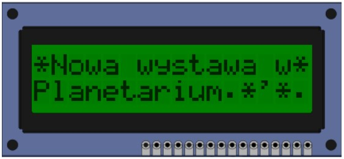

I'm going to try to simulate an animation on a 16x2 LCD screen using custom character creators :smile:

## Prerequisites

Some very useful links:

- [All about LCD screens](https://www.gibbard.me/hd44780_lcd_screen/)
- [Custom Character Maker](https://maxpromer.github.io/LCD-Character-Creator/)
- [CreateCustomCharacter() function](https://openlabpro.com/guide/custom-character-lcd-pic/)

## Implementation

### Main declaration + func

Starting with importing the essential LCD functions like `SendData` that displays characters and `SendCommand` that runs commands (like clear screen, go to line 2).
The `a*` chars are the hex-coded custom characters.

```c
//main.c
#define LCD_SendData(data) { PMADDR = 0x0001; PMDIN1 = data; delay(200); }
#define LCD_SendCommand(command) { PMADDR = 0x0000; PMDIN1 = command; delay(200); }
#define LCD_COMMAND_ROW_0_HOME          0x80 //move to line 1
#define LCD_COMMAND_ROW_1_HOME          0xC0 //move to line 2

void CreateCustomCharacter (unsigned char *Pattern, const char Location)
{ 
    int i=0; 
    LCD_SendCommand(0x40+(Location*8)); //setting CGRAM location
    for (i=0; i<8; i++) {
        LCD_SendData(Pattern[i]); 
    }//Setting pattern from hex format
}

//Declare custom characters
unsigned char a0[] = {0x00,0x00,0x04,0x04,0x0E,0x04,0x04,0x00};
unsigned char a1[] = {0x00,0x04,0x04,0x00,0x1B,0x00,0x04,0x04};
unsigned char a2[] = {0x04,0x04,0x04,0x0A,0x11,0x0A,0x04,0x04};
unsigned char a3[] = {0x04,0x00,0x0A,0x11,0x00,0x0A,0x04,0x04};
unsigned char a4[] = {0x04,0x11,0x00,0x00,0x00,0x00,0x11,0x0A};
```

### Iteration

To use our custom characters we need to pass them through our `CreateCustomCharacter() function that assigns them their 'place' on the LCD screen.
Then in an infinite loop, we first run our 'stop-motion' animation: the 5 custom characters are displayed on the top line on the screen one at a time while moving 1 space to the right with each character.
Since the LCD functions default to putting everything you tell them on the first far-left free space, we add spaces to play with the index.

```c
CreateCustomCharacter(a0, 0);
CreateCustomCharacter(a1, 1);
CreateCustomCharacter(a2, 2);
CreateCustomCharacter(a3, 3);
CreateCustomCharacter(a4, 4);
CreateCustomCharacter(a1, 5);
CreateCustomCharacter(a2, 6);
CreateCustomCharacter(a3, 7);
CreateCustomCharacter(a4, 8);
CreateCustomCharacter(a1, 9);
CreateCustomCharacter(a2, 10);

LCD_ClearScreen (  ); //Clear LCD

while (1) {
    int a = 0;
    LCD_ClearScreen (  );
    LCD_SendCommand(LCD_COMMAND_ROW_0_HOME); //Go to line1
    for (int i=0; i<=16; i++){
        LCD_SendData(a); //display char under location “a”
        delay(200);
        LCD_ClearScreen (  );
        for (int j=0; j<=i; j++) LCD_PutString (" ", sizeof(" ")); //empty space for animation
        a++;
    }
    LCD_ClearScreen (  );
    LCD_SendCommand(LCD_COMMAND_ROW_0_HOME);
    //display string
    LCD_PutString ("*Nowa wystawa w*", sizeof("*Nowa wystawa w*"));
    LCD_SendCommand(LCD_COMMAND_ROW_1_HOME); //go to line2
    LCD_PutString ("Planetarium.*'*.", sizeof("Planetarium.*'*."));
    delay(1000);
}
```

## Conclusion

The see the animation You would have to run it yourself, but this is the text that displays after (running on a simulator for PIC18F4620):


